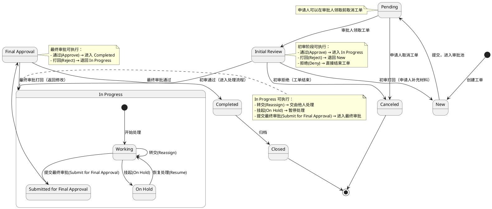
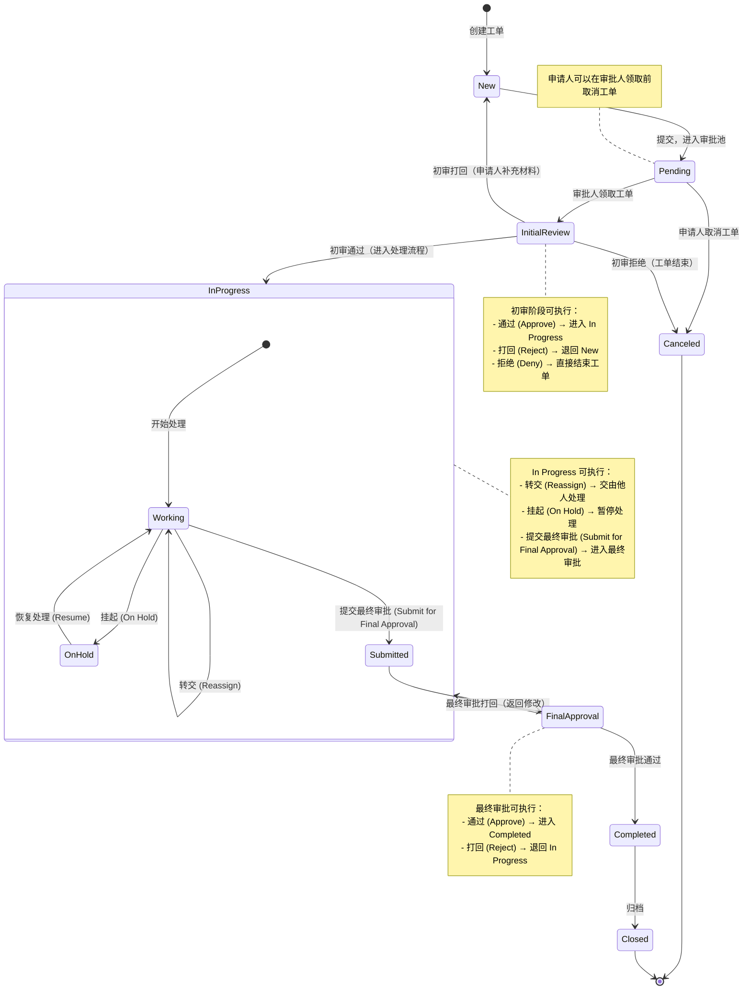

```plantuml
@startuml
state "New" as New
state "Pending" as Pending
state "Initial Review" as InitialReview
state "In Progress" as InProgress {
    state "Working" as Working
    state "On Hold" as OnHold
    state "Submitted for Final Approval" as Submitted
    [*] --> Working : 开始处理
    Working --> Working : 转交(Reassign)
    Working --> OnHold : 挂起(On Hold)
    OnHold --> Working : 恢复处理(Resume)
    Working --> Submitted : 提交最终审批(Submit for Final Approval)
}
state "Final Approval" as FinalApproval
state "Completed" as Completed
state "Closed" as Closed
state "Canceled" as Canceled

[*] --> New : 创建工单
New --> Pending : 提交，进入审批池
Pending --> InitialReview : 审批人领取工单
Pending --> Canceled : 申请人取消工单

InitialReview --> InProgress : 初审通过（进入处理流程）
InitialReview --> New : 初审打回（申请人补充材料）
InitialReview --> Canceled : 初审拒绝（工单结束）

Submitted --> FinalApproval
FinalApproval --> Completed : 最终审批通过
FinalApproval --> InProgress : 最终审批打回（返回修改）

Completed --> Closed : 归档

Canceled --> [*]
Closed --> [*]

note left of Pending
    申请人可以在审批人领取前取消工单
end note

note right of InitialReview
    初审阶段可执行：
    - 通过(Approve) → 进入 In Progress
    - 打回(Reject) → 退回 New
    - 拒绝(Deny) → 直接结束工单
end note

note right of InProgress
    In Progress 可执行：
    - 转交(Reassign) → 交由他人处理
    - 挂起(On Hold) → 暂停处理
    - 提交最终审批(Submit for Final Approval) → 进入最终审批
end note

note right of FinalApproval
    最终审批可执行：
    - 通过(Approve) → 进入 Completed
    - 打回(Reject) → 退回 In Progress
end note
@enduml
```

```mermaid
stateDiagram-v2
    [*] --> New : 创建工单
    New --> Pending : 提交，进入审批池
    Pending --> InitialReview : 审批人领取工单
    Pending --> Canceled : 申请人取消工单
    
    InitialReview --> InProgress : 初审通过（进入处理流程）
    InitialReview --> New : 初审打回（申请人补充材料）
    InitialReview --> Canceled : 初审拒绝（工单结束）

    state InProgress {
        [*] --> Working : 开始处理
        Working --> Working : 转交 (Reassign)
        Working --> OnHold : 挂起 (On Hold)
        OnHold --> Working : 恢复处理 (Resume)
        Working --> Submitted : 提交最终审批 (Submit for Final Approval)
    }

    Submitted --> FinalApproval
    FinalApproval --> Completed : 最终审批通过
    FinalApproval --> InProgress : 最终审批打回（返回修改）

    Completed --> Closed : 归档

    Canceled --> [*]
    Closed --> [*]

    note left of Pending
        申请人可以在审批人领取前取消工单
    end note

    note right of InitialReview
        初审阶段可执行：
        - 通过 (Approve) → 进入 In Progress
        - 打回 (Reject) → 退回 New
        - 拒绝 (Deny) → 直接结束工单
    end note

    note right of InProgress
        In Progress 可执行：
        - 转交 (Reassign) → 交由他人处理
        - 挂起 (On Hold) → 暂停处理
        - 提交最终审批 (Submit for Final Approval) → 进入最终审批
    end note

    note right of FinalApproval
        最终审批可执行：
        - 通过 (Approve) → 进入 Completed
        - 打回 (Reject) → 退回 In Progress
    end note
```